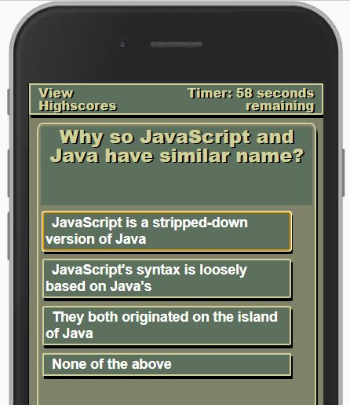
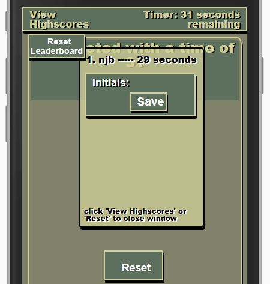

# Code Quiz

## Description

The Code Quiz is a game that allows a user to answer a series of questions to
gauage the users knowledge within a timed interval.

- This quiz gives the outline to continually give an avenue to review what I've
  learned and reinforce that learning over the course of the Bootcamp.
- Adding more and more questions over each section of the bootcamp course will
  allow the game to grow.
- This will allow me a quick and easy avenue to review by actually 'playing' the
  game/quiz, but also will allow me to actively review by adding questions and
  continually adding to the script.
- What I learned?
  - I definitely found / considered multiple ways to solve this [where to store
    questions/answers/scores].
  - The local storage and managing an object array within that was the biggest
    hurdle I had in this homework. The way I set this up there was a different
    response if there were no previous scores stored, vs one, vs multiple... of
    which I had to work through to solve.

## Table of Contents (Optional)

- [Features](#features)
- [Usage](#usage)
- [Credits](#credits)
- [Future Consideration](#future_consideration)
- [Tests](#Tests)

## Features

  <strong>View
Highscores -</strong> clicking gives access to the current leaderboard [no
access to enter new highscore]  <strong>Timer -</strong> current timer amount
[set to max time before start quiz, after finish the timer will hold on score
until reset for new quiz]  <strong>Question Box -</strong> defined color
background where question will be posted for consistent layout and allows user
to focus on an area when taking quiz  <strong>Click to Start -</strong>
button to start the quiz, which will start the timer and show the first
question  <strong>Mobile First Design -</strong> setup with mobile first
design to allow users to access the quiz quickly and remotely without being at a
PC   
<strong>Functionality -</strong> action 'Click to Start' will start the quiz 

- there are 10 questions to answer in 60 seconds (var Timervalue)
- if there is a wrong answer then timer is degregated 5 seconds (var
  wrongPenalty)
- Completing the quiz in time
  - you enter your initials and log your completion time
  - if your time is in the top 10 [most time left is higher ranking], your
    initials will be stored [to localStorage]
- Not completing quiz in time
  - reset button to restart quiz and try again

## Usage

1. Click Start
2. Answer questions   
   - Run out of time (option to reset) 
      
   - Completed and input initials   
3. Reset to take quiz again.   

View Highscores is a button that can bring up the leaderboard 
 

That will show the user the current leaderboard with the top 10 [highest time
remaining is #1]   

- Reset Leaderboard in the top left will run a function to clear the 'leader'
  object in the local storage [vs clear all local storage]
- Leaderboard will show the top 10 scores [if available] if not available, it
  will show all available [in the screenshot, this only has one saved
  leaderboard entry].
  - the local storage functionality will actually store more than 10 scores, but
    the leaderboard rendering will only show the top 10 scores based on most
    time remaining
- bottom of box is directions for the user to utilize on how to proceed [as the
  start button is behind the leaderboard and not clickable until they hide the
  leaderbard]

## Credits

https://stackoverflow.com/users/5105831/tarik

- issue was input of initials upon hitting 'enter' would submit the leaderboard
  entry and reset the layout without giving the user visibility of the
  leaderboard.
  - found solution to disable keydown of 'enter'
  - found in js function : window.addEventListener('keydown',function (e))

## Future_Consideration

1. Make question generation random
   - Need to ensure question not repeated within one quiz
2. Make questions linked to 'sections' and allow user to select via dropdown
   - Highscore by section?
   - Highscore by overall?
3. Disable timer so user can have time review question
   - Do not log time for leaderboard
4. Figure out way to disable not allow users to 'speed' through test [see Test 3
   for example]

## Tests

<!-- prettier-ignore-start -->
1. Test 1 [Start Test] 
    =
   - Click 'Click to Start'
     - Expected outcome:
       - question is presented with 4 buttons to click for an answer
       - timer starts to count down
   - Click 'Reset'
     - Expected outcome:
       - page reloads and back to original start screen

2. Test 2 [Expired time] 
    =
   - Click 'Click to Start'
   - Wait for timer to expire
     - Expected outcome:
       - OUT OF TIME message shown
       - Reset button shows up to reset page (window.reload())

3. Test 3 [Complete with time] 
    =
   - Click 'Click to Start'
   - Click the first option (a or 1) 10 times
        - (you will get -5 seconds for wrong answers, but if you click fast eneough you will complete before timer runs out)
        - Expected outcome:
            - leaderboard pops up
            - initial entry form pops up
    - enter initials
        - Expected outcome:
            - only 3 characters are allowed [max]
    - Click 'Save'
        - Expected outcome:
            - initials and time are logged on to leaderboard

4. Test 4 [Clear Leaderboard]
    =
    -   Click 'View Leaderboard'
        - Expected outcome:
            - Leaderboard is shown
            - Reset Leaderboard button shows
    - Click 'Reset Leaderboard'
        - Expected outcome:
            - Leaderboard is cleared
    - Click 'Reset'
        - Expected outcome:
            - page is reloaded and back to start screen

<!-- prettier-ignore-end -->
